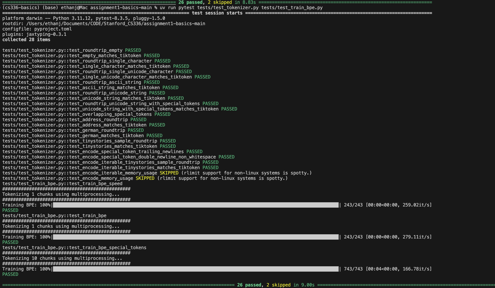
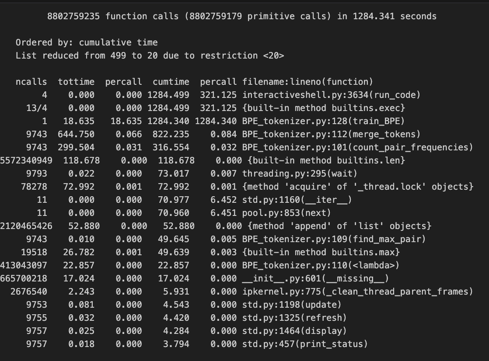
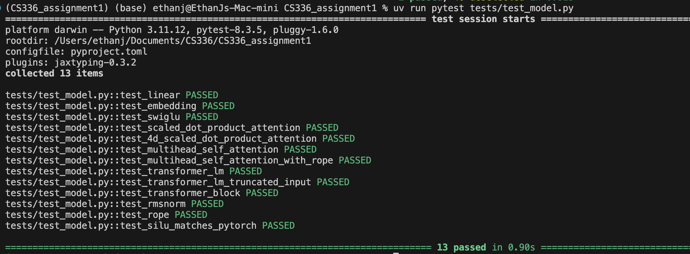
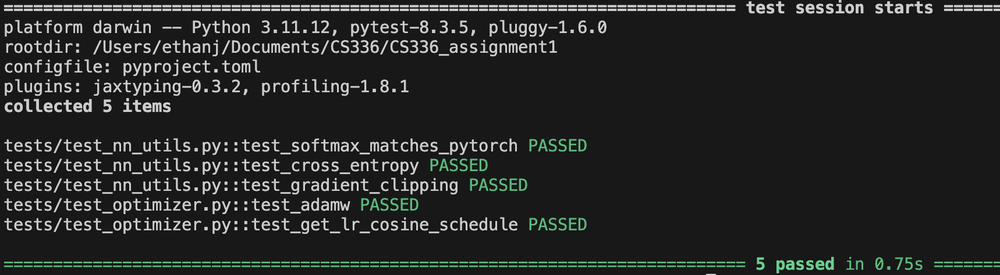
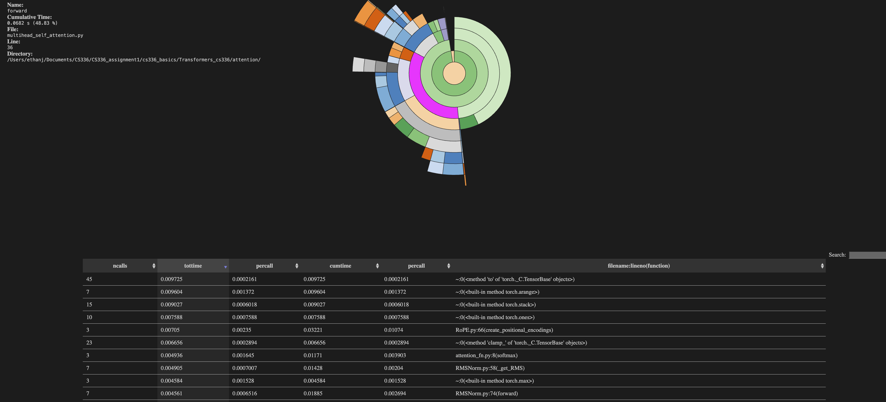
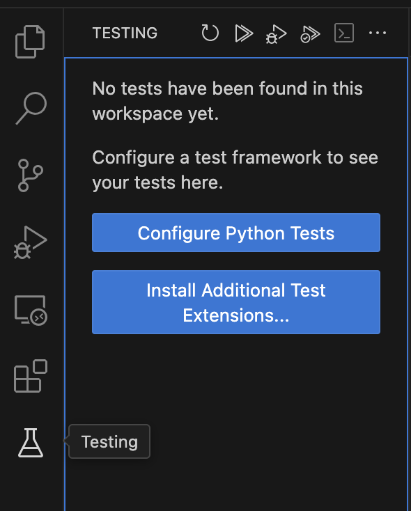
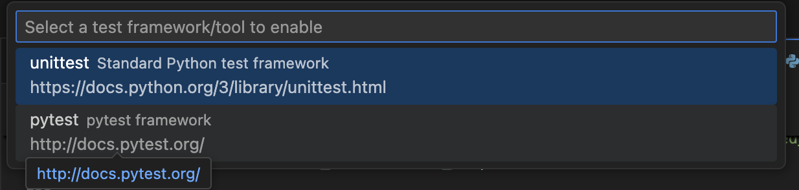
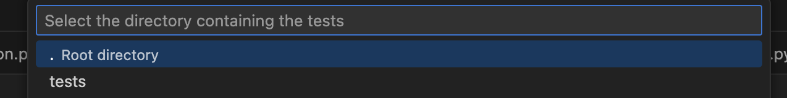
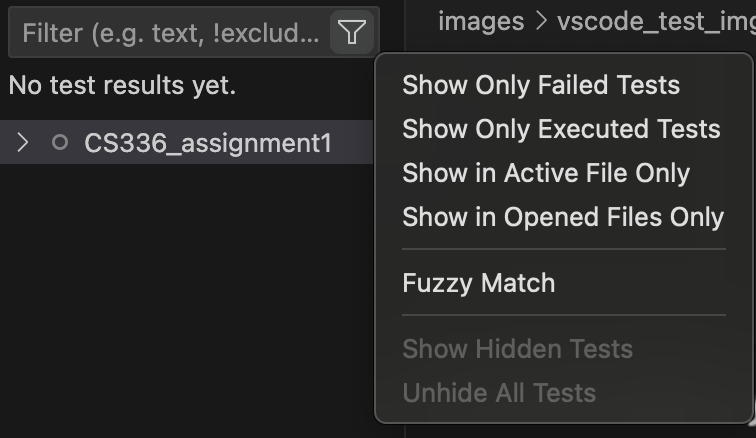
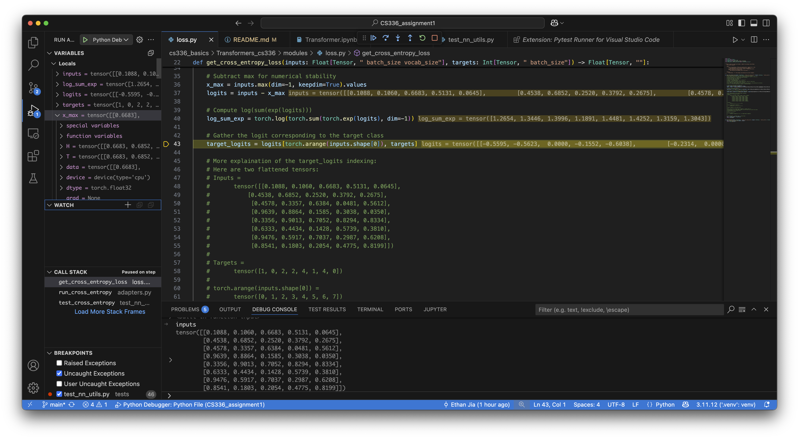

# CS336 Spring 2025 Assignment 1: Basics

# My solutions for Stanford CS336 Assignment 1

## Part 1: BPE Tokenizer

Code in `cs336_basics/BPE_tokenizer.py`
### Trainig Time of TinyStores


## Part 2: Transformer's structures


## Part 3: Training support methods

# Extra Notes:

## 1. Use pytest-profiling + snakeviz to check runtime bottleneck
1. Install


        uv pip install pytest-profiling


        uv pip install snakeviz

2. Run

        pytest --profile tests/test_model.py


        snakeviz prof/combined.prof

3. Example:


## 2. Enable VSCode Debugger
1. Enable Testing with pytest on VSCode
    1. Go to Testing (beaker icon on the left sidebar)
    2. Click "Configure Python Tests"
        1. 
    4. Choose pytest:
        1. 
    5. Choose the folder that has tests file.
        1. 
    5. If you want to re-configure the test or use command directly. 
        1. Open Command Palette by: 
            1. Press Cmd + Shift + P (Mac) or Ctrl + Shift + P (Windows/Linux)
        3. Search for:
            1. Python: Configure Tests
            2. Select the correct test framework (pytest), and when prompted, choose the correct folder that contains your tests
    6. Note: If you clicked the Hide Test, use the filter icon to bring it back.:

        1. 

2. Use Breakpoint in Debug Window, Enjoy.


# CS336 Spring 2025 Assignment 1: Basics
For a full description of the assignment, see the asssignment handout at
[cs336_spring2025_assignment1_basics.pdf](./cs336_spring2025_assignment1_basics.pdf)

If you see any issues with the assignment handout or code, please feel free to
raise a GitHub issue or open a pull request with a fix.

## Setup

### Environment
We manage our environments with `uv` to ensure reproducibility, portability, and ease of use.
Install `uv` [here](https://github.com/astral-sh/uv) (recommended), or run `pip install uv`/`brew install uv`.
We recommend reading a bit about managing projects in `uv` [here](https://docs.astral.sh/uv/guides/projects/#managing-dependencies) (you will not regret it!).

You can now run any code in the repo using
```sh
uv run <python_file_path>
```
and the environment will be automatically solved and activated when necessary.

### Run unit tests


```sh
uv run pytest
```

Initially, all tests should fail with `NotImplementedError`s.
To connect your implementation to the tests, complete the
functions in [./tests/adapters.py](./tests/adapters.py).

### Download data
Download the TinyStories data and a subsample of OpenWebText

``` sh
mkdir -p data
cd data

wget https://huggingface.co/datasets/roneneldan/TinyStories/resolve/main/TinyStoriesV2-GPT4-train.txt
wget https://huggingface.co/datasets/roneneldan/TinyStories/resolve/main/TinyStoriesV2-GPT4-valid.txt

wget https://huggingface.co/datasets/stanford-cs336/owt-sample/resolve/main/owt_train.txt.gz
gunzip owt_train.txt.gz
wget https://huggingface.co/datasets/stanford-cs336/owt-sample/resolve/main/owt_valid.txt.gz
gunzip owt_valid.txt.gz

cd ..
```

