# CS336 Spring 2025 Assignment 1: Enhanced Transformer Implementation

## 🚀 **NEW: Interactive Chat Interface & Advanced Features**

This implementation now includes a comprehensive interactive system with both CLI and web interfaces for chatting with your trained transformer models!

### **🎯 Quick Start - Interactive Chat**

```bash
# Auto-discover model files and launch CLI chat
python -m cs336_basics.interactive cli --auto-discover

# Launch web interface on http://localhost:5000
python -m cs336_basics.interactive web --auto-discover

# Launch both interfaces simultaneously
python -m cs336_basics.interactive both --auto-discover
```

### **✨ Enhanced Features Added**

#### **🤖 Interactive Interfaces**
- **Rich CLI Interface**: Beautiful terminal chat with configuration, statistics, history export
- **Web Interface**: Modern browser-based chat with real-time generation and parameter tuning
- **Conversation Management**: History tracking, export to JSON, session management

#### **⚡ Performance Optimizations**
- **Mixed Precision Training**: FP16/BF16 support with automatic loss scaling
- **KV-Cache**: Efficient autoregressive generation with key-value caching  
- **Torch Compile**: Automatic JIT compilation for 2x+ speedup
- **Gradient Checkpointing**: Memory-efficient training for larger models

#### **🎛️ Advanced Generation Features**
- **Multiple Sampling Strategies**: Greedy, Top-k, Top-p (Nucleus), Temperature, Mixed
- **Real-time Parameter Adjustment**: Change temperature, top-p, max tokens on the fly
- **Generation Statistics**: Track tokens/second, memory usage, cache efficiency
- **Streaming Generation**: Real-time token generation with typing indicators

#### **💾 Enhanced Infrastructure**
- **Advanced Checkpointing**: Automatic checkpoint rotation, best model tracking
- **Configuration Management**: YAML-based configs with auto-discovery
- **Comprehensive Logging**: Detailed performance metrics and debugging info
- **Multi-device Support**: Optimized for CUDA, MPS (Apple Silicon), and CPU

---

## 📱 **Interface Usage Examples**

### **Command Line Interface**
```bash
# Launch with specific model files
python -m cs336_basics.interactive cli \
    --model checkpoints/model.pt \
    --vocab dataset/vocab.json \
    --merges dataset/merges.txt \
    --config configures/m4.yaml

# Features: Rich terminal UI, conversation history, export, statistics
```

### **Web Interface**  
```bash
# Start web server
python -m cs336_basics.interactive web --host 0.0.0.0 --port 8080

# Features: Browser chat, real-time config, statistics dashboard, export
```

### **Advanced Configuration**
```bash
# Use specific device and enable debug mode
python -m cs336_basics.interactive web \
    --device cuda \
    --debug \
    --host localhost \
    --port 5000
```

---

## 🏗️ **Architecture Overview**

### **New Module Structure**
```
cs336_basics/
├── optimization/          # Performance enhancements
│   ├── mixed_precision.py  # FP16/BF16 training
│   ├── compilation.py      # Torch compile utilities
│   └── checkpointing.py    # Advanced checkpoint management
├── inference/             # Text generation engine
│   ├── cache.py           # KV-cache implementation
│   ├── generator.py       # Main generation engine
│   ├── samplers.py        # Sampling strategies
│   └── utils.py           # Inference utilities
├── ui/                    # User interfaces
│   ├── cli.py             # Rich terminal interface
│   ├── web_app.py         # Flask web application
│   ├── static/            # Web assets (CSS, JS)
│   └── templates/         # HTML templates
└── interactive.py         # Main interface launcher
```

---

## 🧪 **Original CS336 Assignment Implementation**

# My solutions for Stanford CS336 Assignment 1
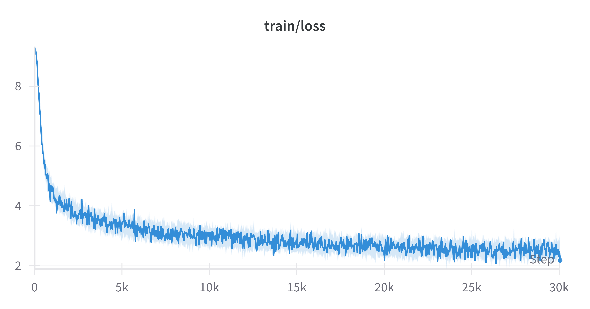
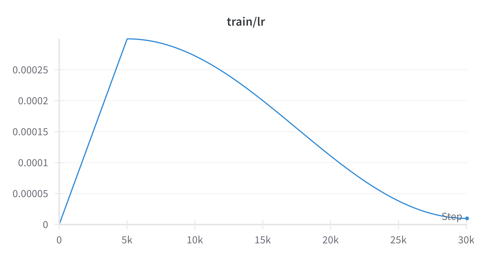 
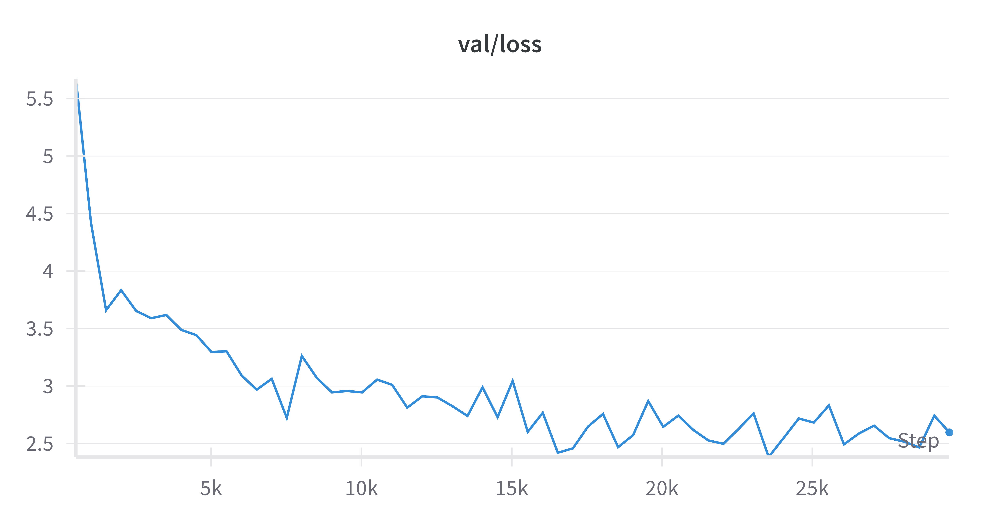
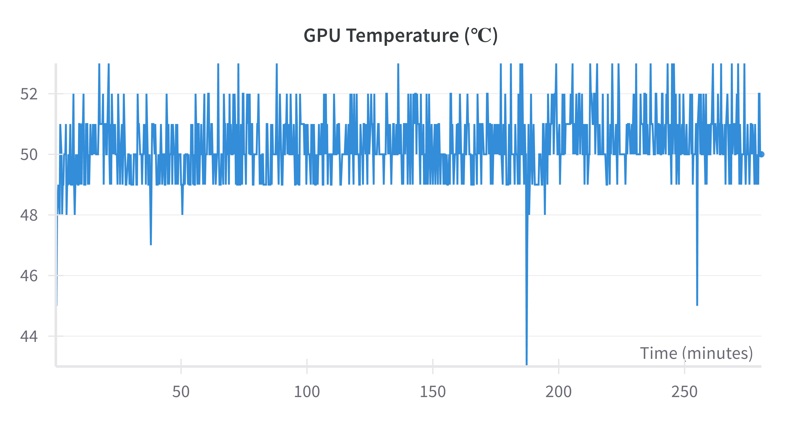 
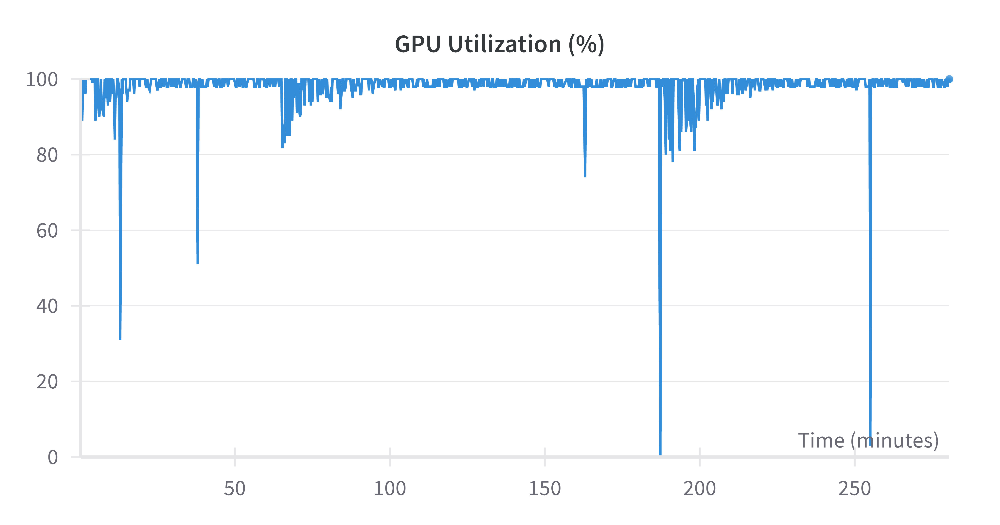 
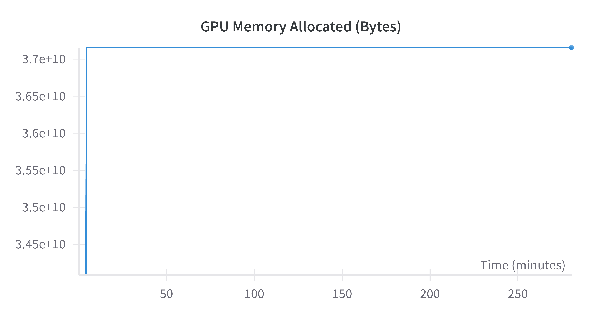 
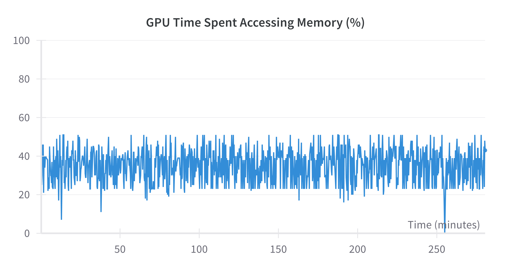 
## Passed all tests
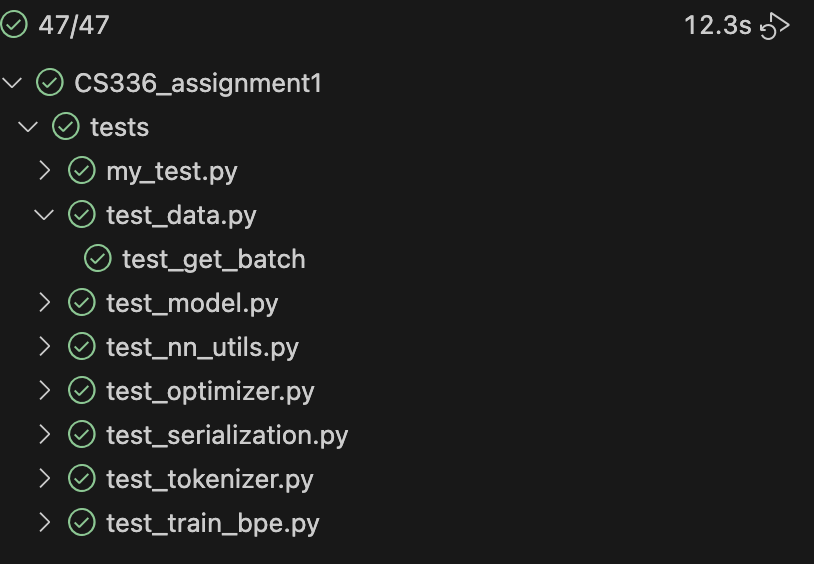
## Part 1: BPE Tokenizer
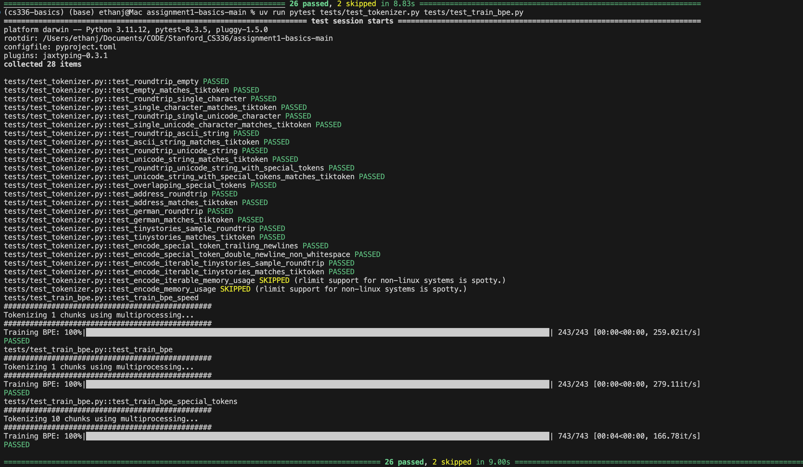
Code in `cs336_basics/BPE_tokenizer.py`
### Trainig Time of TinyStores
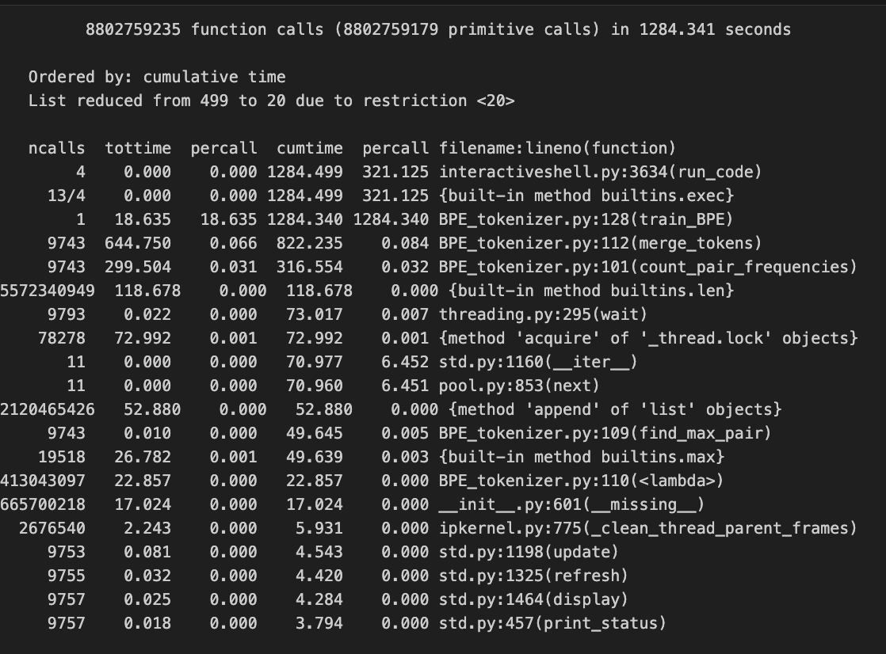

## Part 2: Transformer's structures
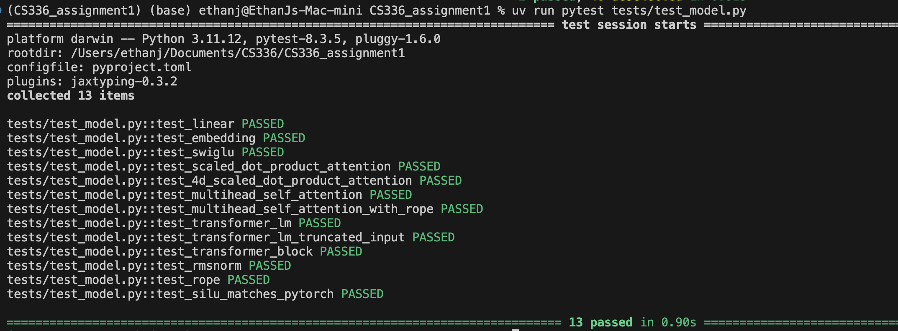

## Part 3: Training support methods
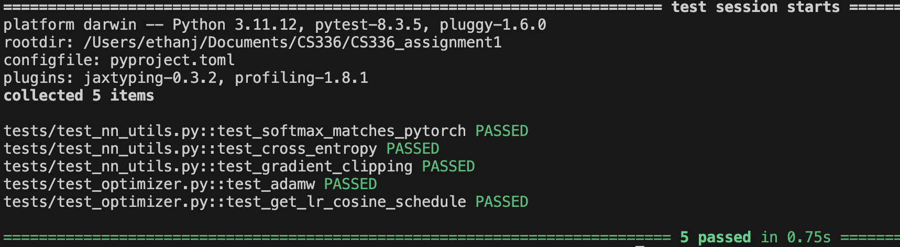

## Part 4: Tools methods
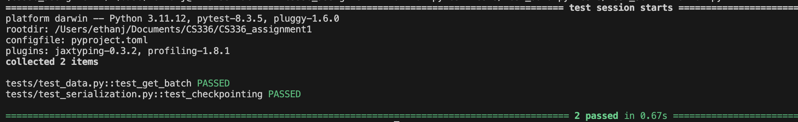
# Extra Notes:

## 1. Use pytest-profiling + snakeviz to check runtime bottleneck
1. Install


        uv pip install pytest-profiling


        uv pip install snakeviz

2. Run

        pytest --profile tests/test_model.py


        snakeviz prof/combined.prof

3. Example:
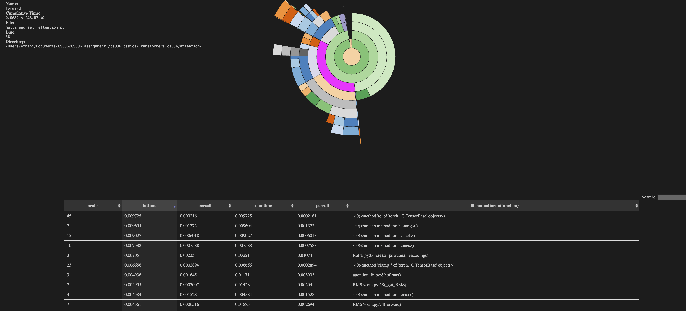

## 2. Enable VSCode Debugger
1. Enable Testing with pytest on VSCode
    1. Go to Testing (beaker icon on the left sidebar)
    2. Click "Configure Python Tests"
        1. 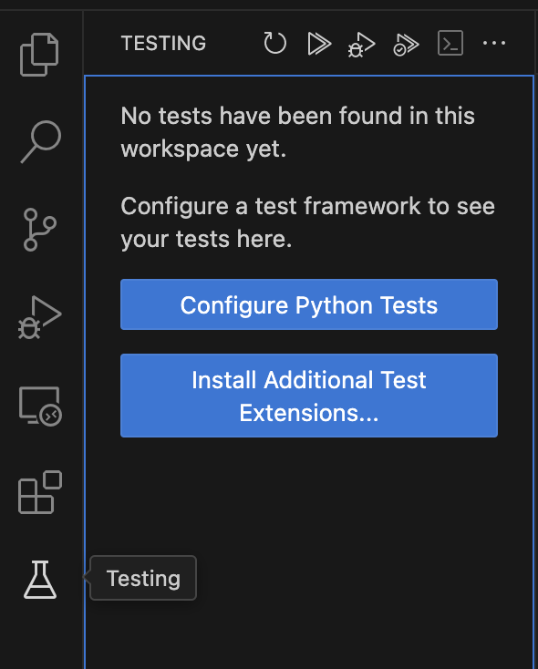
    4. Choose pytest:
        1. 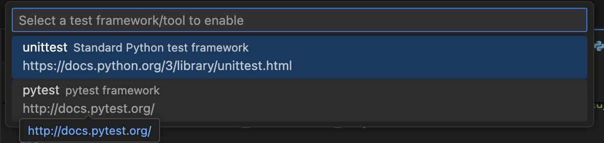
    5. Choose the folder that has tests file.
        1. 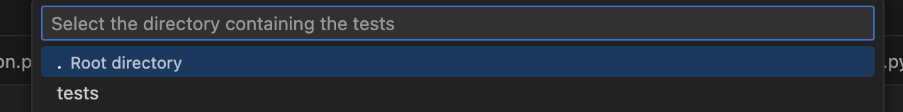
    5. If you want to re-configure the test or use command directly. 
        1. Open Command Palette by: 
            1. Press Cmd + Shift + P (Mac) or Ctrl + Shift + P (Windows/Linux)
        3. Search for:
            1. Python: Configure Tests
            2. Select the correct test framework (pytest), and when prompted, choose the correct folder that contains your tests
    6. Note: If you clicked the Hide Test, use the filter icon to bring it back.:

        1. 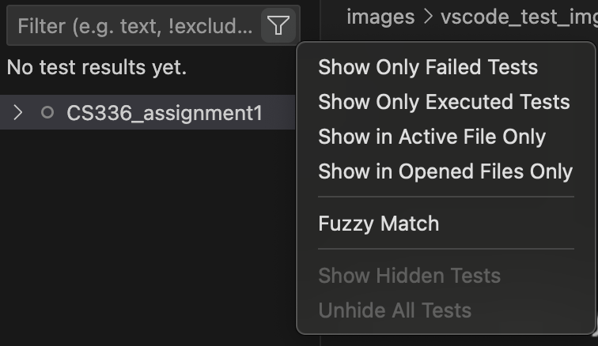

2. Use Breakpoint in Debug Window, Enjoy.
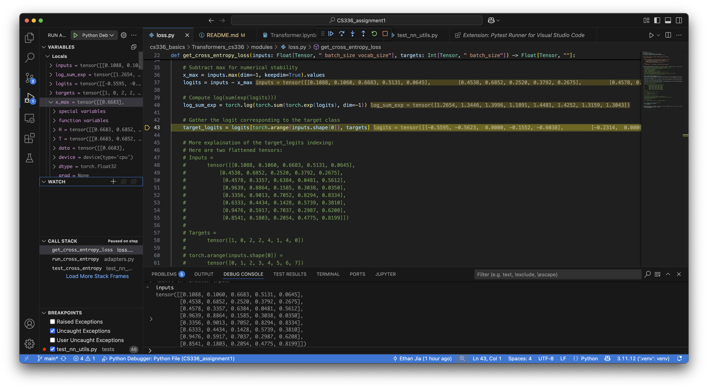

# CS336 Spring 2025 Assignment 1: Basics
For a full description of the assignment, see the asssignment handout at
[cs336_spring2025_assignment1_basics.pdf](./cs336_spring2025_assignment1_basics.pdf)

If you see any issues with the assignment handout or code, please feel free to
raise a GitHub issue or open a pull request with a fix.

## Setup

### Environment
We manage our environments with `uv` to ensure reproducibility, portability, and ease of use.
Install `uv` [here](https://github.com/astral-sh/uv) (recommended), or run `pip install uv`/`brew install uv`.
We recommend reading a bit about managing projects in `uv` [here](https://docs.astral.sh/uv/guides/projects/#managing-dependencies) (you will not regret it!).

You can now run any code in the repo using
```sh
uv run <python_file_path>
```
and the environment will be automatically solved and activated when necessary.

### Run unit tests


```sh
uv run pytest
```

Initially, all tests should fail with `NotImplementedError`s.
To connect your implementation to the tests, complete the
functions in [./tests/adapters.py](./tests/adapters.py).

### Download data
Download the TinyStories data and a subsample of OpenWebText

``` sh
mkdir -p data
cd data

wget https://huggingface.co/datasets/roneneldan/TinyStories/resolve/main/TinyStoriesV2-GPT4-train.txt
wget https://huggingface.co/datasets/roneneldan/TinyStories/resolve/main/TinyStoriesV2-GPT4-valid.txt

wget https://huggingface.co/datasets/stanford-cs336/owt-sample/resolve/main/owt_train.txt.gz
gunzip owt_train.txt.gz
wget https://huggingface.co/datasets/stanford-cs336/owt-sample/resolve/main/owt_valid.txt.gz
gunzip owt_valid.txt.gz

cd ..
```

